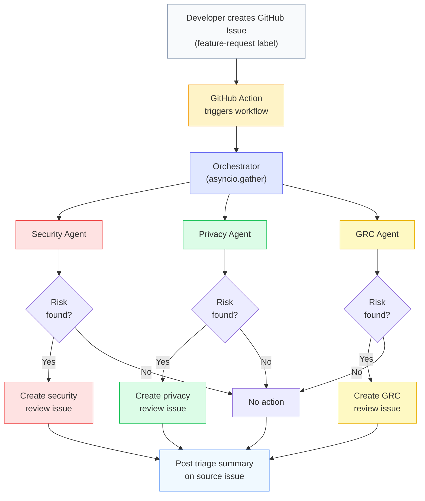

# SecureFlow

**Automated feature risk screening for product security, privacy, and GRC teams.**

SecureFlow is a multi-agent triage system that screens feature descriptions for risk signals and routes them to the appropriate review teams via GitHub Issues. It runs as a GitHub Action — when a developer labels an issue `feature-request`, SecureFlow reads the description, runs three specialist screening agents in parallel, and creates targeted review issues for any team that needs to investigate.

### Demo

<video src="https://github.com/trwilcoxson/secureflow/raw/main/demo/secureflow_demo.webm" controls width="100%"></video>

## How It Works



The system is organized into four layers:

### Layer 1: Trigger
A GitHub Action watches for the `feature-request` label on issues. When it fires, it calls `python agentic_system.py --issue-number N`, which reads the issue body via `gh issue view --json`.

### Layer 2: Orchestrator
A **deterministic Python function** (not an LLM agent) that coordinates the pipeline. It validates input (20–10,000 chars), dispatches all three agents in parallel via `asyncio.gather()`, collects their structured outputs, and determines whether the feature needs team review. If any agent flags risk (`requires_review=True`), the orchestrator creates a review issue routed to that team. It posts a summary comment on the source issue with the overall result. All coordination logic is explicit code — no LLM decides "what to do next."

### Layer 3: Specialist Agents
Three Pydantic AI agents run in parallel, each screening for different risk categories:

| Agent | Screens For | Example Triggers |
|-------|-------------|------------------|
| **Security** | Attack surface, data exposure, auth gaps, third-party trust | New API endpoint, credentials in logs, missing MFA |
| **Privacy** | PII collection, new data flows, automated decisions | User tracking, data shared with vendors, profiling |
| **GRC** | Regulatory obligations, audit impact, vendor risk | Payment card data (PCI), health data (HIPAA), EU data (GDPR) |

Each agent is defined as:
```python
security_agent = Agent(
    instructions=SECURITY_INSTRUCTIONS,  # loaded from instructions/security.md
    output_type=SecurityAnalysis,         # Pydantic model enforces structured output
)
```

The LLM cannot return freeform text — Pydantic AI forces the response into the schema (list of concerns, severity, requires_review flag). This is how the orchestrator can make deterministic routing decisions from LLM output.

### Layer 4: Tools
- **Issue creator**: `gh issue create` via `asyncio.create_subprocess_exec` (argument list, no shell injection). Creates labeled review issues routed to the right team.
- **Issue reader**: `gh issue view --json` to extract feature descriptions from GitHub issues.
- **Dry-run mode**: `DRY_RUN=true` by default — logs what would be created without calling the GitHub API.

## Team Ownership

Each agent's screening criteria lives in a separate instruction file:

```
instructions/
  security.md   ← Product Security team owns this
  privacy.md    ← Privacy team owns this
  grc.md        ← GRC team owns this
```

The system loads these at startup via `load_instructions()`. Teams update what counts as "risky" in their domain by editing their file — no changes to system code required. In production, each team could maintain their instruction file in their own repository, pulled in via submodule or CI artifact.

## Quick Start

**Prerequisites:** Python 3.10+ (developed on 3.14, CI runs on 3.12). For live mode (`DRY_RUN=false`), the [GitHub CLI (`gh`)](https://cli.github.com/) must be installed and authenticated.

```bash
# Clone and set up
git clone https://github.com/trwilcoxson/secureflow.git
cd secureflow
python -m venv .venv
source .venv/bin/activate
pip install -r requirements.txt

# Configure
cp .env.example .env
# Add your OPENAI_API_KEY to .env

# Run demo (screens a sample feature + runs evaluation suite)
python agentic_system.py

# Screen a specific feature
python agentic_system.py --feature-description "Add user authentication with OAuth2..."

# Run evaluation suite only
python agentic_system.py --evaluate

# Generate PDF report
python generate_report.py
```

### GitHub Action (Production)

The system runs automatically when the `feature-request` label is added to any issue. Add `OPENAI_API_KEY` as a repository secret — no other configuration needed.

```yaml
# .github/workflows/security-triage.yml (already included)
on:
  issues:
    types: [labeled]
jobs:
  triage:
    if: github.event.label.name == 'feature-request'
```

## CLI Reference

| Flag | Description |
|------|-------------|
| `--issue-number N` | Screen GitHub issue #N (used by the Action) |
| `--feature-description "..."` | Screen inline feature text |
| `--evaluate` | Run the 7-case evaluation suite |
| `--generate-figures` | Regenerate charts from saved results |
| `--dry-run` | Force dry-run mode (skip GitHub API calls) |

## Evaluation

Seven test cases spanning the risk spectrum, validated by rule-based evaluators and an LLM judge:

| Case | Expected | Signals the screener should detect |
|------|----------|-------------------------------------|
| Low-risk internal tool | GO | No risk signals — SSO-gated, anonymized, read-only |
| Critical data exposure | NO-GO | Routes to all three teams — PII in the open, no auth, no encryption |
| Third-party integration | CONDITIONAL | Routes to security + privacy — API keys in config, PII in vendor logs |
| ML credit scoring | NO-GO | Routes to privacy + GRC — automated decisions, bias-prone training data |
| Healthcare portal | NO-GO | Routes to all three teams — PHI to third-party LLM, weak auth |
| Vague description | Cautious | Flags insufficient detail, recommends clarification before proceeding |
| CSS change | GO | No risk signals — pure cosmetic, no data or backend changes |

Consistent pass rate: **96–100%** (6-7/7). The specific case that fails varies across runs due to LLM stochasticity (severity calibration or rationale quality), but the core routing decisions (which teams need to review) are stable.

## Safeguards

| Safeguard | Implementation |
|-----------|---------------|
| Dry-run mode | `DRY_RUN=true` default locally — no GitHub API calls |
| Input validation | 20–10,000 character limits on feature descriptions |
| Output validation | Pydantic schema enforcement on all agent outputs |
| No shell injection | `subprocess` with argument lists, never `shell=True` |
| Secret management | API keys via env vars / GitHub Secrets only |
| Label-gated trigger | Action only fires on `feature-request` labeled issues |
| Scoped permissions | GitHub Action uses minimal `issues: write` permission |
| False positive control | Agent instructions explicitly suppress harmless-change flags |

## Project Structure

```
secureflow/
├── agentic_system.py              # Agents, orchestrator, tools, evaluation
├── generate_report.py             # PDF report generation (fpdf2)
├── record_demo.py                 # Playwright browser recording script
├── instructions/
│   ├── security.md                # Security screening criteria
│   ├── privacy.md                 # Privacy screening criteria
│   └── grc.md                     # GRC screening criteria
├── .github/workflows/
│   └── security-triage.yml        # GitHub Action workflow
├── figures/                       # Generated architecture + eval charts
├── demo/                          # Demo video + screenshots
├── module_summary.pdf             # Project report
├── results.json                   # Latest demo + eval results
├── requirements.txt               # Python dependencies
├── .env.example                   # Environment variable template
└── README.md
```

## Tech Stack

| Component | Role |
|-----------|------|
| [Pydantic AI](https://ai.pydantic.dev/) | Agent framework with structured output |
| [pydantic-evals](https://ai.pydantic.dev/evals/) | Evaluation framework with LLM judges |
| OpenAI gpt-4o-mini | LLM backend |
| GitHub Actions | CI/CD — triggers on issue labeling |
| `gh` CLI | Issue creation via `asyncio.create_subprocess_exec` |
| fpdf2 | PDF report generation |
| matplotlib | Architecture diagram + evaluation charts |

## Author

Tim Wilcoxson — February 2026
