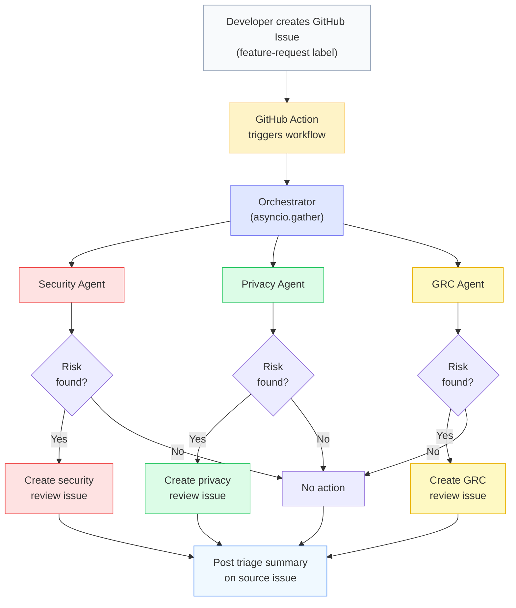

# SecureFlow

**Automated feature risk screening for product security, privacy, and GRC teams.**

SecureFlow is a multi-agent triage system that screens feature descriptions for risk signals and routes them to the appropriate review teams via GitHub Issues. It runs as a GitHub Action -- when a developer labels an issue `feature-request`, SecureFlow reads the description, runs three specialist screening agents in parallel, and creates targeted review issues for any team that needs to investigate.

## How It Works



Each agent screens for different categories of risk:

| Agent | Screens For | Example Triggers |
|-------|-------------|------------------|
| **Security** | Attack surface, data exposure, auth gaps, third-party trust | New API endpoint, credentials in logs, missing MFA |
| **Privacy** | PII collection, new data flows, automated decisions | User tracking, data shared with vendors, profiling |
| **GRC** | Regulatory obligations, audit impact, vendor risk | Payment card data (PCI), health data (HIPAA), EU data (GDPR) |

## Team Ownership

Each agent's screening criteria lives in a separate instruction file:

```
instructions/
  security.md   ← Product Security team owns this
  privacy.md    ← Privacy team owns this
  grc.md        ← GRC team owns this
```

The system loads these at startup via `load_instructions()`. Teams update what counts as "risky" in their domain by editing their file -- no changes to system code required. In production, each team could maintain their instruction file in their own repository, pulled in via submodule or CI artifact.

## Quick Start

```bash
# Clone and set up
git clone https://github.com/trwilcoxson/secureflow.git
cd secureflow
python -m venv .venv
source .venv/bin/activate
pip install -r requirements.txt

# Configure
cp .env.example .env
# Add your OPENAI_API_KEY to .env

# Run demo (screens a sample feature + runs evaluation suite)
python agentic_system.py

# Screen a specific feature
python agentic_system.py --feature-description "Add user authentication with OAuth2..."

# Run evaluation suite only
python agentic_system.py --evaluate

# Generate PDF report
python generate_report.py
```

### GitHub Action (Production)

The system runs automatically when the `feature-request` label is added to any issue. Add `OPENAI_API_KEY` as a repository secret -- no other configuration needed.

```yaml
# .github/workflows/security-triage.yml (already included)
on:
  issues:
    types: [labeled]
jobs:
  triage:
    if: github.event.label.name == 'feature-request'
```

## CLI Reference

| Flag | Description |
|------|-------------|
| `--issue-number N` | Screen GitHub issue #N (used by the Action) |
| `--feature-description "..."` | Screen inline feature text |
| `--evaluate` | Run the 7-case evaluation suite |
| `--generate-figures` | Regenerate charts from saved results |
| `--dry-run` | Force dry-run mode (skip GitHub API calls) |

## Evaluation

Seven test cases spanning the risk spectrum, validated by rule-based evaluators and an LLM judge:

| Case | Expected | Why |
|------|----------|-----|
| Low-risk internal tool | GO | SSO-protected, anonymized data -- no review needed |
| Critical data exposure | NO-GO | Unauthenticated API serving SSNs and credit cards |
| Third-party integration | CONDITIONAL | SendGrid with PII in debug logs |
| ML credit scoring | NO-GO | Automated decisions on people, bias risk |
| Healthcare portal | NO-GO | PHI sent to OpenAI, no MFA |
| Vague description | Cautious | Insufficient detail triggers conservative screening |
| CSS change | GO | Pure cosmetic -- zero risk signals expected |

Current pass rate: **96.4%** (6/7). The healthcare portal case occasionally rates HIGH instead of CRITICAL due to LLM stochasticity -- acceptable for triage since the feature still routes to all three teams.

## Safeguards

| Safeguard | Implementation |
|-----------|---------------|
| Dry-run mode | `DRY_RUN=true` default locally -- no GitHub API calls |
| Input validation | 20--10,000 character limits on feature descriptions |
| Output validation | Pydantic schema enforcement on all agent outputs |
| No shell injection | `subprocess` with argument lists, never `shell=True` |
| Secret management | API keys via env vars / GitHub Secrets only |
| Label-gated trigger | Action only fires on `feature-request` labeled issues |
| Scoped permissions | GitHub Action uses minimal `issues: write` permission |
| False positive control | Agent instructions explicitly suppress harmless-change flags |

## Project Structure

```
secureflow/
├── agentic_system.py              # Agents, orchestrator, tools, evaluation
├── generate_report.py             # PDF report generation (fpdf2)
├── instructions/
│   ├── security.md                # Security screening criteria
│   ├── privacy.md                 # Privacy screening criteria
│   └── grc.md                     # GRC screening criteria
├── .github/workflows/
│   └── security-triage.yml        # GitHub Action workflow
├── figures/                       # Generated architecture + eval charts
├── module_summary.pdf             # Project report
├── results.json                   # Latest demo + eval results
├── requirements.txt               # Python dependencies
├── .env.example                   # Environment variable template
└── README.md
```

## Tech Stack

| Component | Role |
|-----------|------|
| [Pydantic AI](https://ai.pydantic.dev/) | Agent framework with structured output |
| [pydantic-evals](https://ai.pydantic.dev/evals/) | Evaluation framework with LLM judges |
| OpenAI gpt-4o-mini | LLM backend |
| GitHub Actions | CI/CD -- triggers on issue labeling |
| `gh` CLI | Issue creation via `asyncio.create_subprocess_exec` |
| fpdf2 | PDF report generation |
| matplotlib | Architecture diagram + evaluation charts |

## Author

Tim Wilcoxson -- February 2026
